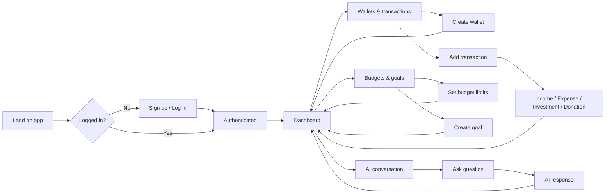

# Dalla

A **smart finance advisor** web app built and deployed on AWS. Users track transactions across multiple wallets, set budgets and goals, and get AI-powered answers about their spending and habits.

---

## Features

### Authentication (AWS)

- **Sign up** and **log in** with email and password via AWS (e.g. Amazon Cognito).
- Session management handled by the chosen AWS auth service.

### Wallets & Transactions

- **Multiple wallets** per user; each wallet can have **multiple transactions**.
- **Transaction types:** Income, Expense, Investment, Donation.
- Each transaction has:
  - **Tags**
  - **Description**
- **Subcategories** per transaction type:
  - Default subcategories provided for each type.
  - Users can add their own subcategories.

### Budgets & Goals

- **Budgets** — Set spending limits on expense categories; the app tracks usage against these limits.
- **Goals** — Define targets (e.g. “Invest $500 this month”); progress is tracked over time.

### AI Conversation

- **Conversation feature** — Users ask questions in natural language about their data, e.g.:
  - “What was the most avoidable expense this month?”
  - Questions about budgets, goals, and transactions.
- Questions are processed by **AI on AWS** (e.g. Amazon Bedrock) over the user’s data; responses are shown in the app.
- **Extensible** — Designed so more AI features can be added, such as:
  - Suggesting new goals
  - Suggesting restraint in certain expense categories
  - Other advice and insights

---

## User flow

---

## Deploy on AWS

See **`notes/Deploy-AWS.md`** for full steps (Terraform, ECR, DB schema, frontend build and S3 sync). After deploy, open the app via the CloudFront URL using **http** (not https) so the browser allows the HTTP backend (mixed-content workaround).

---

## Project Context

- **Course:** CSCI5409 Advanced Topics in Cloud Computing (Winter 2026)  
- **Deliverable:** Mid-term cloud project (20% of grade).  
- **Requirements:** Fully functional cloud application on AWS; at least one service from Compute, Storage, Networking, and Database; Infrastructure as Code (IaC); single-command deployment; original code; runs within AWS Academy Learner Lab constraints.

---

## Tech Stack (Planned)

- **Auth:** AWS (e.g. Cognito) for sign up, login, and sessions.
- **Compute:** e.g. Lambda, EC2, or ECS.
- **Storage:** e.g. S3, EBS, or EFS.
- **Networking:** e.g. API Gateway, CloudFront, VPC.
- **Database:** e.g. DynamoDB or RDS.
- **AI:** AWS AI services (e.g. Bedrock) for the conversation and extensible advice features.

---
