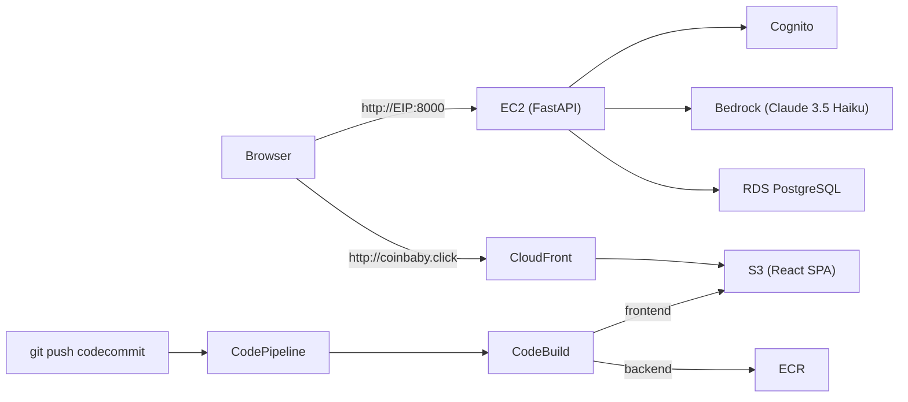
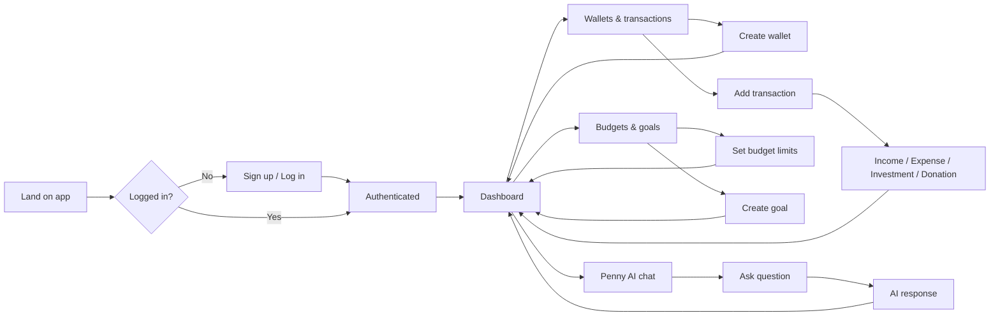

# coinBaby (Dalla)

A **smart finance advisor** web app on AWS. Users track transactions across multiple wallets, set budgets and goals, and chat with **Penny** — an AI assistant powered by Amazon Bedrock (Claude 3.5 Haiku) that answers questions about their spending and habits.

**Live:** [http://coinbaby.click](http://coinbaby.click)

---

## Architecture

```mermaid
flowchart LR
    Browser -->|"http://coinbaby.click"| CloudFront
    CloudFront --> S3["S3 (React SPA)"]
    Browser -->|"http://EIP:8000"| EC2["EC2 (FastAPI)"]
    EC2 --> RDS["RDS PostgreSQL"]
    EC2 --> Bedrock["Bedrock (Claude 3.5 Haiku)"]
    EC2 --> Cognito
    Push["git push codecommit"] --> CodePipeline
    CodePipeline --> CodeBuild
    CodeBuild -->|backend| ECR
    CodeBuild -->|frontend| S3
```

| Layer | Service |
|-------|---------|
| Frontend | S3 + CloudFront, custom domain via Route 53 + ACM |
| Backend | EC2 `t3.micro`, Elastic IP, Docker |
| Database | RDS PostgreSQL 16 (`db.t3.micro`) |
| Auth | Cognito User Pool (auto-confirm via Lambda trigger) |
| AI | Bedrock — Claude 3.5 Haiku inference profile |
| CI/CD | CodeCommit → CodePipeline → CodeBuild (build image, deploy via SSM, build frontend) |
| IaC | Terraform (single `terraform apply`) |

---

## Features

### Authentication

- Sign up and log in with email/password via **Amazon Cognito**.
- Auto-confirmed on sign-up (Pre Sign-Up Lambda trigger) — no email verification step.

### Wallets & Transactions

- Multiple wallets per user; each wallet holds transactions.
- **Transaction types:** Income, Expense, Investment, Donation.
- Each transaction has tags, description, and a subcategory (defaults provided; users can add custom ones).

### Budgets & Goals

- **Budgets** — spending limits on expense categories; progress tracked automatically.
- **Goals** — savings/investment targets with progress bars computed from transactions.

### Penny (AI Chat)

- Chat assistant on the dashboard powered by **Amazon Bedrock** (Claude 3.5 Haiku via cross-region inference profile).
- Answers questions about spending, budgets, goals using the user's financial data as context.
- Quick-question templates for common queries.

---

## User Flow

```mermaid
flowchart LR
    A[Land on app] --> B{Logged in?}
    B -->|No| C[Sign up / Log in]
    C --> D[Authenticated]
    B -->|Yes| D
    D --> E[Dashboard]
    E --> F[Wallets & transactions]
    E --> G[Budgets & goals]
    E --> H[Penny AI chat]
    F --> F1[Create wallet]
    F --> F2[Add transaction]
    F2 --> F2a[Income / Expense / Investment / Donation]
    G --> G1[Set budget limits]
    G --> G2[Create goal]
    H --> H1[Ask question]
    H1 --> H2[AI response]
    F1 --> E
    F2a --> E
    G1 --> E
    G2 --> E
    H2 --> E
```

---

## Deploy on AWS

See **`notes/Deploy-AWS.md`** for full steps (Terraform, ECR, DB schema, CI/CD pipeline). After deploy the app is available at `http://coinbaby.click` (or the CloudFront URL if no custom domain is configured). Use **http** (not https) so the browser allows calls to the HTTP backend without mixed-content blocking.

---

## Project Context

- **Course:** CSCI5409 Advanced Topics in Cloud Computing (Winter 2026)
- **Deliverable:** Mid-term cloud project (20% of grade).
- **Requirements:** Fully functional cloud application on AWS; at least one service from Compute, Storage, Networking, and Database; Infrastructure as Code (IaC); single-command deployment; original code.

---

## Tech Stack

- **Auth:** Amazon Cognito (User Pool + Lambda auto-confirm trigger)
- **Compute:** EC2 `t3.micro` (backend Docker container), Lambda (Cognito trigger)
- **Storage:** S3 (frontend static assets, pipeline artifacts)
- **Networking:** VPC, CloudFront, Route 53, ACM
- **Database:** RDS PostgreSQL 16
- **AI:** Amazon Bedrock (Claude 3.5 Haiku inference profile)
- **CI/CD:** CodeCommit, CodePipeline, CodeBuild, ECR, SSM Run Command

---
