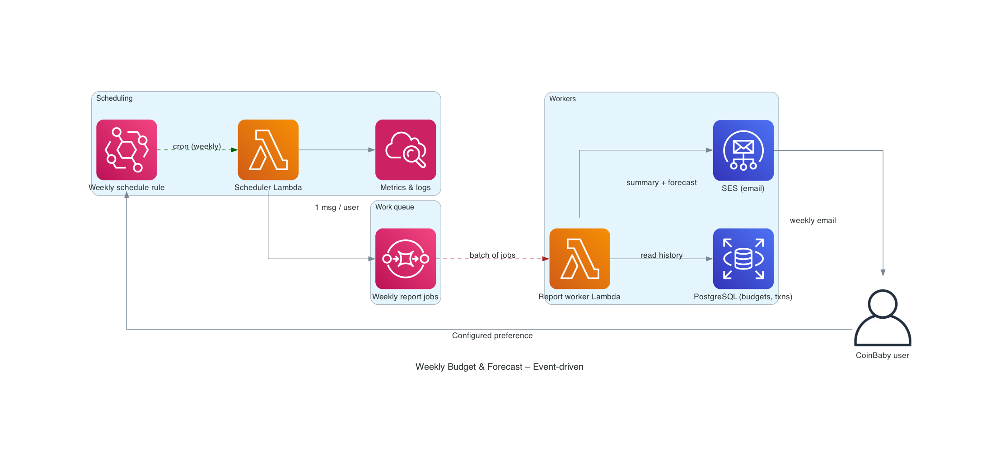

### 5410 – Engagement Activity 3 (Event‑Driven Weekly Reports)

#### Project context

This is a personal finance advisor web app: users track transactions, set budgets and goals, and get insights. The system sends weekly summary emails (budget status, forecast, and nudges if they haven’t logged recently). Below is an event‑driven design to do that at scale without overloading the main API.

---

#### Architecture (concise)

**1. Scheduling** — An EventBridge rule runs weekly and invokes a **Scheduler Lambda**. The Lambda queries the database for eligible users (e.g. opted‑in, active) and enqueues **one SQS message per user** (e.g. `user_id`, period) into a “Weekly report jobs” queue.

**2. Queue** — SQS buffers the work. With thousands of users you get thousands of messages; they drain at a controlled rate. Failed messages can redrive to a DLQ for inspection.

**3. Workers** — SQS is the event source for a **Report Worker Lambda**. AWS polls the queue, batches messages, and runs many Lambdas in parallel. Each invocation: loads the user’s transactions/budgets from **RDS**, computes summary + forecast + “no recent activity” logic, then sends the email via **SES**.

**4. Observability** — Lambdas log to **CloudWatch**; DLQ depth and failure metrics support alerts and debugging.

---

#### Diagram

