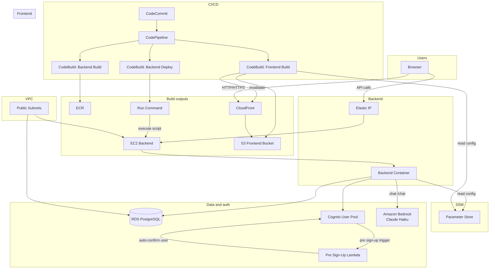

# coinBaby – Architecture

## Overview

Dalla is a full-stack personal finance app deployed on AWS. **Users** interact with a **single-page frontend** served over **CloudFront** (origin: **S3**). The frontend calls a **REST API** running on an **EC2** instance (backend container from **ECR**). The API uses **Cognito** for authentication, **RDS (PostgreSQL)** for persistence, and **Amazon Bedrock** (Claude Haiku) for AI-powered chat. Configuration (database URL, Cognito IDs, API URL) is stored in **SSM Parameter Store** and read at runtime or build time.

**Auth:** The frontend uses **AWS Amplify** (Cognito auth APIs and `@aws-amplify/ui-react` Authenticator) with the Cognito User Pool ID and App Client ID. Cognito handles sign-up and sign-in; a **Pre Sign-Up Lambda** trigger auto-confirms new users so they can log in immediately without email verification. The backend validates Cognito JWTs on every request.

**AI Chat:** The backend's `/chat` endpoint fetches the user's wallets, transactions, budgets, and goals, injects them into a prompt, and calls **Amazon Bedrock** (Claude Haiku inference profile). The AI persona is **Penny** — a playful financial assistant. The inline chat panel lives on the Dashboard.

**Deployment** is fully automated: code lives in **CodeCommit**. A **CodePipeline** (triggered on push to the configured branch, default `main`) runs: **CodeBuild** builds the backend Docker image (linux/amd64) and pushes to **ECR**; a second **CodeBuild** stage runs **SSM Run Command** on the EC2 instance to execute a deploy script (ECR login, optional Docker prune, pull image, run **create_tables** in a one-off container, then stop/start the backend container with env from SSM); a third **CodeBuild** stage builds the frontend (env from SSM at build time), syncs to **S3** with `--delete`, and invalidates **CloudFront**. Pipeline artifacts are stored in an **S3** bucket. No manual ECR push or S3 upload is required.

**SSM** is used in two ways: **Parameter Store** holds configuration (DATABASE_URL, Cognito IDs, API URL) that the backend and the frontend build read at runtime or build time; **Run Command** is used by the pipeline to execute the deploy script on the backend EC2 instance (pull image, restart container) without SSH.

**Network:** Everything runs in one **VPC** with public subnets. The **backend EC2** has a public **Elastic IP** and is reachable on the backend port (e.g. 8000). **RDS** is in the same VPC, not publicly accessible; only the backend security group can reach it. The frontend is served via **CloudFront** (optional HTTP so the browser can call the HTTP backend without mixed-content issues).

---

## Architecture diagram

---

## Component summary

| Component               | Role                                                                                                                                    |
| ----------------------- | --------------------------------------------------------------------------------------------------------------------------------------- |
| **CodeCommit**          | Git repository; push to trigger pipeline.                                                                                               |
| **CodePipeline**        | Orchestrates Source (CodeCommit) → BuildBackend → DeployBackend → BuildFrontend; artifact store in S3.                                   |
| **CodeBuild**           | Three projects: backend build (buildspec-backend.yml, push image to ECR); backend deploy (buildspec-backend-deploy.yml, SSM SendCommand + wait); frontend (buildspec-frontend.yml, SSM params → npm ci/build → S3 sync + CloudFront invalidation; caches node_modules). |
| **ECR**                 | Stores backend Docker image; EC2 pulls `:latest` on deploy.                                                                             |
| **EC2**                 | Single instance with Docker and **SSM Agent** installed; runs backend container deployed by pipeline, gets config from SSM.             |
| **RDS**                 | PostgreSQL 16 (db.t3.micro); backend connects via private VPC; schema applied on each deploy via `create_tables` (one-off container in deploy script). |
| **Cognito**             | User pool + app client; sign-up/sign-in and JWT validation. Pre Sign-Up Lambda auto-confirms users (no email verification).             |
| **Pre Sign-Up Lambda**  | Triggered by Cognito on sign-up; sets `autoConfirmUser` + `autoVerifyEmail` so users can log in immediately.                            |
| **Amazon Bedrock**      | Claude Haiku (inference profile) powers the Penny chat assistant; called by the backend with user financial context in the prompt.      |
| **S3**                  | Holds static frontend build; access only via CloudFront (OAI).                                                                          |
| **CloudFront**          | Serves frontend; optional `allow-all` protocol so app can use HTTP backend.                                                             |
| **SSM Parameter Store** | Stores DATABASE_URL, Cognito IDs, API URL; read by backend (deploy script) and by frontend CodeBuild at build time.                     |
| **SSM Run Command**     | Used by pipeline (CodeBuild backend-deploy) to run script on EC2 via **SSM Agent**: ECR login, pull image, run `create_tables` one-off container, then stop/start backend container with SSM env; no SSH. Uses document `AWS-RunShellScript`; build waits for command completion. |
