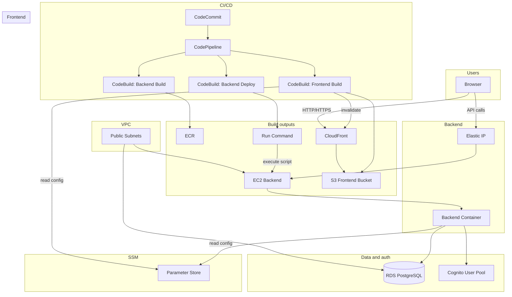

# Dalla – Architecture

## Overview

Dalla is a full-stack application deployed on AWS. **Users** interact with a **single-page frontend** served over **CloudFront** (origin: **S3**). The frontend calls a **REST API** running on an **EC2** instance (backend container from **ECR**). The API uses **Cognito** for authentication and **RDS (PostgreSQL)** for persistence. Configuration (database URL, Cognito IDs, API URL) is stored in **SSM Parameter Store** and read at runtime or build time.

**Deployment** is fully automated: code lives in **CodeCommit**. A **CodePipeline** runs on push: **CodeBuild** builds the backend Docker image and pushes it to **ECR**, deploys the backend by running **SSM Run Command** on the EC2 instance (pull new image, restart container), and builds the frontend (with env from SSM), then syncs to **S3** and invalidates **CloudFront**. No manual ECR push or S3 upload is required.

**SSM** is used in two ways: **Parameter Store** holds configuration (DATABASE_URL, Cognito IDs, API URL) that the backend and the frontend build read at runtime or build time; **Run Command** is used by the pipeline to execute the deploy script on the backend EC2 instance (pull image, restart container) without SSH.

**Network:** Everything runs in one **VPC** with public subnets. The **backend EC2** has a public **Elastic IP** and is reachable on the backend port (e.g. 8000). **RDS** is in the same VPC, not publicly accessible; only the backend security group can reach it. The frontend is served via **CloudFront** (optional HTTP so the browser can call the HTTP backend without mixed-content issues).

---

## Architecture diagram

---

## Component summary

| Component               | Role                                                                                                                                    |
| ----------------------- | --------------------------------------------------------------------------------------------------------------------------------------- |
| **CodeCommit**          | Git repository; push to trigger pipeline.                                                                                               |
| **CodePipeline**        | Orchestrates Source → BuildBackend → DeployBackend → BuildFrontend.                                                                     |
| **CodeBuild**           | Builds backend image (push ECR), runs SSM deploy on EC2, builds frontend and deploys to S3 + CloudFront.                                |
| **ECR**                 | Stores backend Docker image; EC2 pulls `:latest` on deploy.                                                                             |
| **EC2**                 | Single instance with Docker and **SSM Agent** installed; runs backend container deployed by pipeline, gets config from SSM.             |
| **RDS**                 | PostgreSQL; backend connects via private VPC; tables created once via `create_tables`.                                                  |
| **Cognito**             | User pool + app client; frontend and backend use for sign-up/sign-in and token validation.                                              |
| **S3**                  | Holds static frontend build; access only via CloudFront (OAI).                                                                          |
| **CloudFront**          | Serves frontend; optional `allow-all` protocol so app can use HTTP backend.                                                             |
| **SSM Parameter Store** | Stores DATABASE_URL, Cognito IDs, API URL; read by backend (deploy script) and by frontend CodeBuild at build time.                     |
| **SSM Run Command**     | Used by pipeline (CodeBuild) to deploy backend: runs script on EC2 via **SSM Agent** (pull image, restart container); no SSH required.  |
