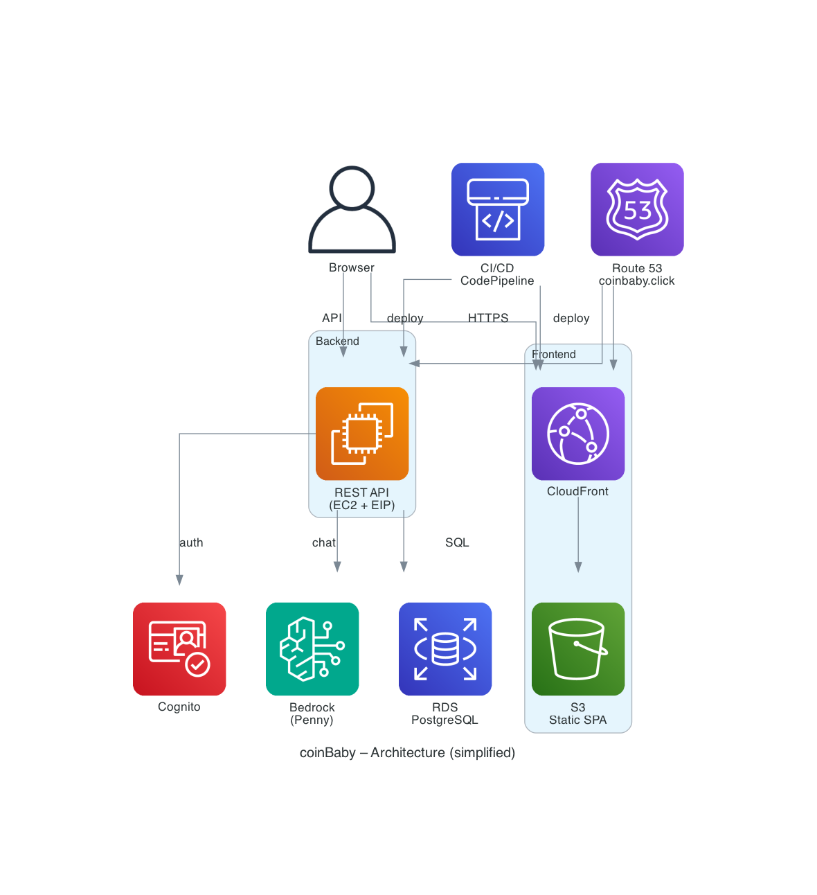
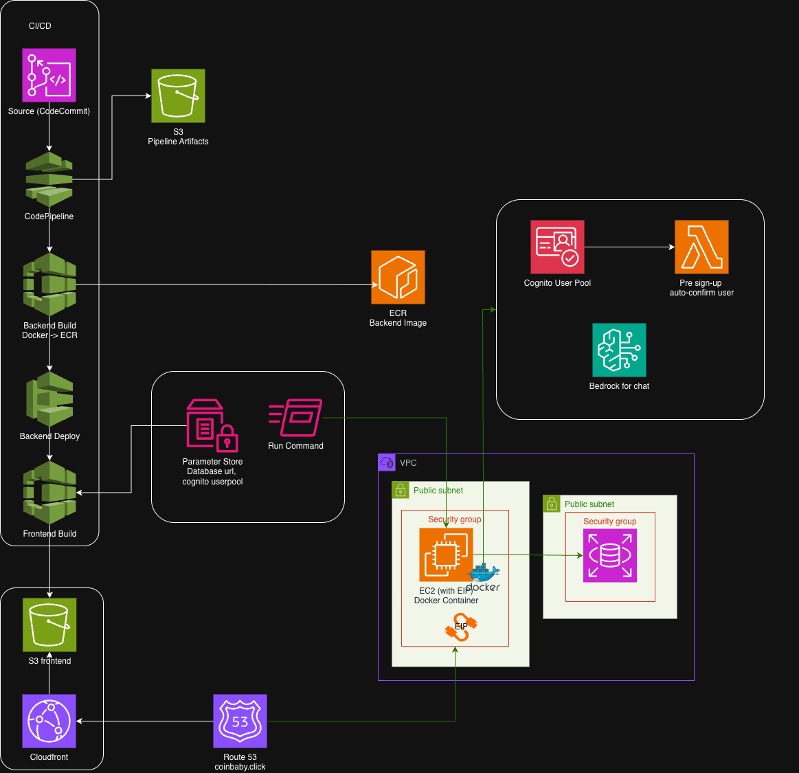

# coinBaby
### Smart Personal Finance Advisor

---

## What is coinBaby?

- Unified accounts, track transactions
- AI assistant (Penny) for advice
- Budgets, goals, insights
- **Target:** Individuals, web app

---

## Architecture — High Level

- React → S3 → CloudFront | FastAPI/Docker → EC2 | PostgreSQL → RDS
- Cognito, Bedrock | `terraform apply`

---

## Architecture — Detail

---

## User Flows

- **Auth** → Cognito (+ Lambda auto-confirm)
- **Transaction** → JWT → Backend → RDS
- **Chat** → Backend → Bedrock → response
- **Dashboard** → RDS → charts

---

## AWS Choices

| Service | Use | Why |
|---------|-----|-----|
| EC2 | Backend | Transparent, free-tier |
| RDS | Data | Managed, relational |
| S3 + CloudFront | Frontend | Cheap, edge |
| Cognito | Auth | JWT, managed |
| Bedrock | AI | Claude, no hosting |

---

## What We Skipped

- **ECS** — 1 container
- **Lambda backend** — Cold starts, pools
- **API Gateway** — Cost, latency
- **DynamoDB** — Relational fit

---

## CI/CD

- CodeCommit → CodePipeline → CodeBuild
- **Backend:** Docker → ECR → SSM restart EC2
- **Frontend:** Build → S3 → CloudFront invalidation
- `git push` = deploy

---

![[Pasted image 20260301222855.png]]

---

## Security — In Place

- HTTPS (CloudFront + ACM)
- SSM (KMS), EBS encrypted
- JWT, VPC, least-privilege IAM
- S3 via OAI only

---

## IAM Roles — Least Privilege

- Backend EC2 role: SSM, CloudWatch logs, ECR pull, RDS access
- CodeBuild/CodePipeline roles: ECR push, S3 (frontend), CloudFront invalidation

---

## Security — Gaps

| Gap               | Fix                        |
| ----------------- | -------------------------- |
| Backend HTTP      | ALB + ACM                  |
| RDS subnets       | Private subnets            |
| No WAF            | WAF or rate-limit          |
| RDS not encrypted | `storage_encrypted = true` |

---

## Data

- **RDS:** Users, wallets, txns, budgets
- **S3:** Assets, artifacts | **ECR:** Images | **localStorage:** JWT
- ~20 MB / 100 users / year

---

## Cost

- **~$35–50/mo** (50–100 users)
- EC2 + RDS ~$20–25, Bedrock ~$5–15, rest ~$5–10
- Serverless ~$15–25 but less control

---

## Takeaways

- Full-stack AWS, IaC
- EC2/RDS for learning
- Security layered + known gaps
- CI/CD from `git push`
- Bedrock for AI

---

## Next Steps ?

- Natural language input
- Smarter Context