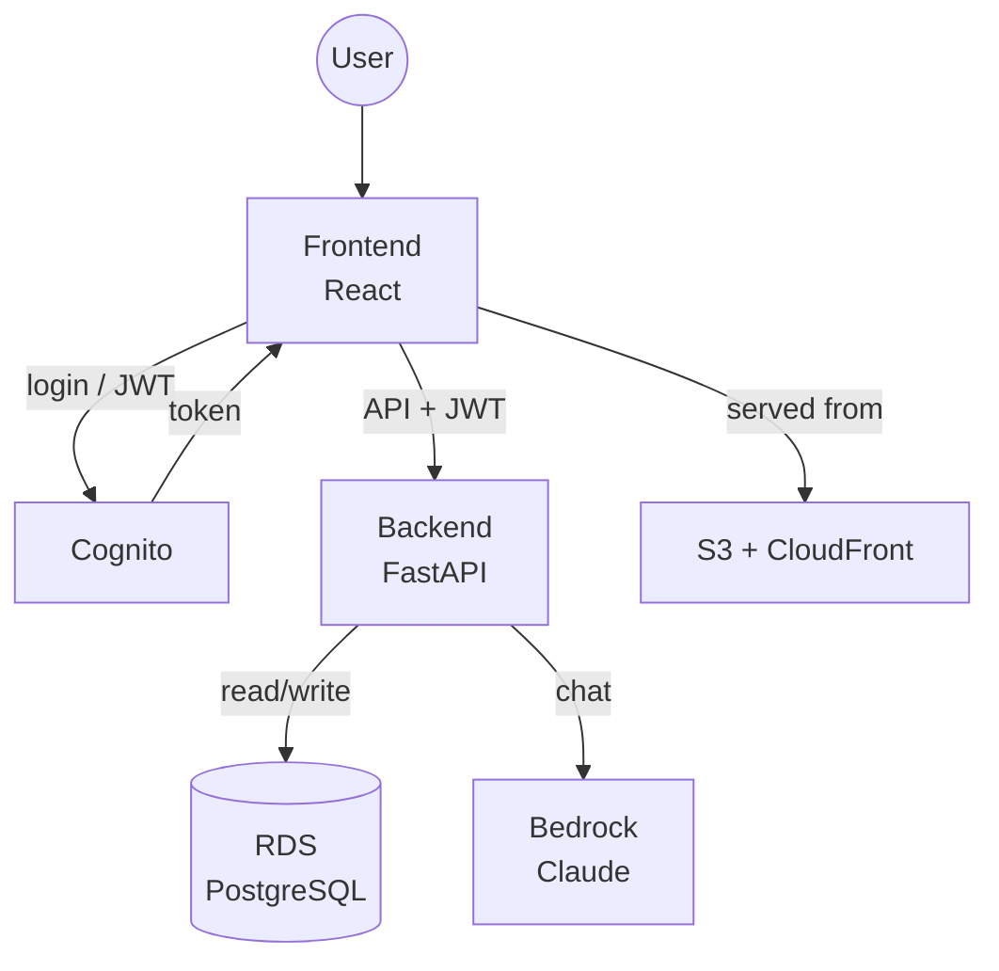

# Project Report

## 1. Project Introduction

**coinBaby** is a smart personal finance advisor that brings all your financial accounts together, tracks every transaction, and provides tailored guidance through its AI assistant, Penny. More than just a ledger, coinBaby helps you set budgets, monitor goals, and get clear, practical advice for managing your money and making personal finance simple.

### Users

The typical user is an individual managing personal finances—not a business or accountant. They seek a clear, unified view of their accounts (e.g., cash, bank, savings) and straightforward feedback—all via an easy-to-use web app.

Accordingly, coinBaby targets a small to moderate user base (tens to low hundreds). It is not built for high-traffic; performance and capacity reflect its project-scale scope.

### Use-case

- **Auth** — Cognito sign-up and login should take under three seconds, with instant auto-confirmation (no email verification).
- **Transaction logging** — add, edit, or delete transactions instantly; recent transactions load within one second.
- **AI chat** — Penny's responses (DB query + Bedrock) should return in about five seconds.
- **Dashboard** — loads all key info in under two seconds.

### Infrastructure context

The app runs entirely on AWS. The backend is a python FastAPI running in a Docker container on a single EC2 instance. The database is a PostgreSQL RDS instance. The frontend is a React SPA deployed to S3 and served through CloudFront. Authentication is handled by Cognito. AI chat is implemented using Bedrock.

This is a single-instance implementation and with simple infrastructure, we have it reproducible with a single `terraform apply`.

---

## 2. AWS Services — Selection and Justification

---

### Compute — EC2 + ECR + Lambda

- **EC2 (t3.micro)**
  - Runs python backend in Docker.
  - Free-tier eligible. Simple and direct: SSH in, see/manage everything.
  - Great for learning and transparency.
- **ECR**
  - Stores our Docker image.
- **Lambda**
  - Used only for Cognito post Sign-Up trigger(user get's automatically confirmed).
  - Good for short, event-driven tasks.

**Alternatives considered:**
- **ECS**
  - Overkill: Just for 1 container.
- **Lambda for backend**
  - Slow cold starts.
  - Problematic state: connection pools, schema setup don't work well as stateless functions.
- **Docker Hub**
  - Would require Docker credentials stored somewhere = more security risk.

---

### Storage — S3 + EBS

- **S3**
  - Hosts frontend static assets (React build) and stores build artifacts from CI/CD (CodePipeline).
  - Cheap, durable, easy to manage.
- **EBS (gp3 SSD)**
  - 20 GB root disk for EC2.
  - Stores OS, Docker, logs. Fast and reliable.

**Alternatives considered:**
- **Amplify Hosting**
  - Easy but hides too much—want to see how S3, CloudFront, etc. fit together.

---

### Networking & Content Delivery — VPC + CloudFront + Route 53

- **VPC**
  - Custom subnets (public) for EC2 and RDS.
  - Security groups control access.
- **CloudFront**
  - Serves frontend (`coinbaby.click`), SPA routing, OAI — keeps S3 private.
  - Caches at edge locations.
- **Route 53**
  - Custom domain and DNS.

**Alternatives considered:**
- **Skip custom domain**
  - `d1abc123.cloudfront.net` isn't user-friendly and it would be great to add a custom URL project on resume.
- **API Gateway**
  - Adds validation/rate limits, but backend already validates & authenticates, but could have enabled https on backend. 
  - Would just add extra cost and latency(extra hop) for this small scale.

---

### Database — RDS PostgreSQL

- **RDS PostgreSQL (db.t3.micro)**
  - Lives in private subnet, not public.
  - Handles all relational data: users, wallets, transactions, budgets/goals.
  - Automated backups, managed.
  - Clean separation between compute and data.

**Alternatives considered:**
- **DynamoDB**
  - Would need lots of data modeling and denormalization for relational data.
- **Aurora Serverless**
  - Scales to zero = cheap, but slow cold starts. 

---

## 3. Final Architecture — How Everything Fits Together

---

### Architecture Overview

coinBaby is a full-stack web application built on AWS infrastructure. The frontend is a React single-page application (SPA) served through CloudFront and S3. The backend is a FastAPI Python service running in Docker on EC2. The database is PostgreSQL on RDS. Authentication is managed by Cognito. AI chat is powered by AWS Bedrock (Claude Haiku 3.5).

The architecture follows a clean separation of concerns: presentation (React), application logic (Python FastAPI), data persistence (PostgreSQL), and external services (Cognito, Bedrock).

![[coinBaby.drawio.png]]

![[coinBaby-Detailed.drawio.png]]

---

### Component Integration Flow

**User journey — browser to response:**

1. **Open `coinbaby.click`**  
   Route 53 resolves DNS → CloudFront → fetches static SPA from S3 → React app loads.

2. **Sign up / Log in**  
   Frontend sends credentials to Cognito (AWS SDK), which auto-confirms via Lambda, returns JWT to frontend (stored in localStorage).

3. **Add a transaction**  
   Frontend sends POST to backend with JWT. Backend validates token, gets user ID, writes transaction to RDS, responds with success.

4. **AI chat with Penny**  
   Frontend sends POST to `/api/chat` with message + JWT. Backend validates JWT, gathers user data, calls Bedrock (Claude Haiku 3.5), returns AI response to frontend.

5. **View dashboard**  
   Frontend requests `/api/dashboard` with JWT. Backend validates, queries RDS for user’s summary data, returns results, frontend renders charts/tables.

---

### Data Architecture

**Data sources:**
- User input (manual transaction entry, chat messages)
- Cognito (user identity, authentication tokens)
- Bedrock (AI-generated responses)

**Data flow and formats:**
- Communication between frontend and backend is via JSON over HTTP.
- Backend interacts with RDS using SQL queries, and with Bedrock through its JSON API.
- Authentication is handled using JWT tokens from Cognito.

**Data storage overview:**

| Data type               | Storage                      | Typical size     | Retention         |
|-------------------------|------------------------------|------------------|-------------------|
| User data & profiles    | RDS PostgreSQL               | Small per user   | Permanent         |
| Wallets, transactions   | RDS PostgreSQL               | Small per record | Permanent         |
| Budgets and goals       | RDS PostgreSQL               | Small per record | Permanent         |
| Chat messages           | Not stored (future: RDS)     | N/A              | N/A               |
| JWT tokens              | Frontend (localStorage)      | ~2 KB            | 1 hour            |
| Frontend assets         | S3                           | ~5 MB total      | Permanent         |
| Docker images           | ECR                          | ~500 MB/image    | Last 3 images     |
| Build artifacts         | S3                           | ~10 MB/build     | 30 days           |

**Estimated volume:**  
For a sample 100-user, 1-year scenario, total data stored in RDS is well below 20 MB, far within the free tier.

**Note:**  
All critical user and application data is stored in normalized relational tables in RDS, with foreign key constraints protecting data integrity and all user data isolated per user account. The schema is purposefully designed to accommodate expansion (custom categories, budgeting, multi-wallet, etc.) without tight coupling or redundancy.

---

### Programming Languages and Code Components

**Frontend — JavaScript (React)**
- **Why React:** Component-based UI, large ecosystem, excellent for SPAs
- **Code required for:** UI components (login, dashboard, transaction form, chat), state management, API client, authentication flow

**Backend — Python (FastAPI)**
- **Why Python:** Clean syntax, rapid development, strong AWS SDK support
- **Why FastAPI:** Fast, automatic API docs (OpenAPI), async support, type hints
- **Key libraries:** `fastapi`, `sqlalchemy` (ORM), `psycopg2` (PostgreSQL), `boto3` (AWS SDK), `python-jose` (JWT), `pydantic` (validation)
- **Code required for:** API endpoints (CRUD operations), JWT authentication middleware, database access (SQLAlchemy async engine and session per request), Bedrock API integration, SSM Parameter Store integration

**Infrastructure — HCL (Terraform)**
- **Why Terraform:** Infrastructure as code, reproducible deployments, state management
- **Resources defined:** VPC, subnets, security groups, EC2, RDS, S3, CloudFront, Route 53, ACM, Cognito, Lambda, ECR, CodePipeline, CodeBuild, SSM parameters

**Lambda — Python**
- **Purpose:** Cognito post-signup trigger for auto-confirmation
- **Function:** Calls `AdminConfirmSignUp` API to immediately activate new users

**CI/CD — Bash + YAML**
- **Purpose:** Automated deployment pipeline
- **Scripts:** Docker build/push to ECR, React build/S3 sync, SSM Run Command for backend restart, CloudFront cache invalidation

---

### Deployment Process

**Initial setup (one-time):**

1. **Terraform:** Run `terraform init` and `terraform apply` to create all AWS resources (VPC, EC2, RDS, S3, CloudFront, Cognito, ECR, CodeCommit, CodeBuild, CodePipeline, etc.).

2. **Git push:** Add CodeCommit as remote and push: `git remote add codecommit <url>` and `git push codecommit main` (pipeline automatically creates database tables on first run).

**Continuous deployment (every code push):**

1. Developer pushes to CodeCommit main branch
2. CodePipeline automatically detects change and triggers build
3. **Backend:** CodeBuild builds Docker image (`--platform linux/amd64`), pushes to ECR, uses SSM Run Command to restart container on EC2
4. **Frontend:** CodeBuild builds React app with SSM config, syncs to S3, invalidates CloudFront cache

That's it—just `terraform apply` for infrastructure and `git push` for code updates.

---

### How the App Components Work Together

- **Frontend (React app):** Runs in the browser. Handles signup, login, and all user interactions. Talks to AWS Cognito (for authentication) and sends API requests to the backend with a JWT for each user.
- **Cognito:** Manages user accounts and logins. Returns a JWT token after successful authentication, which the frontend attaches to every API call.
- **Backend (FastAPI on EC2):** Receives API requests from the frontend. Verifies JWTs with Cognito, uses the token to identify the user, and enforces per-user data isolation. Handles all app logic, talks to the database, and retrieves config securely from AWS SSM Parameter Store.
- **Database (RDS, PostgreSQL):** Stores all application data (users, transactions, etc.) in a relational schema. Only accessible from backend EC2, with credentials managed in SSM.
- **AI (Bedrock, Claude Haiku):** For chat and advice, the backend builds a prompt from the user's data and sends it to Bedrock's Claude model for a response.
- **File storage & Hosting:** The frontend build is uploaded to S3 and served globally via CloudFront, with Route 53 providing the DNS name. CloudFront only allows access to S3 via a secure Origin Access Identity.
- **CI/CD:** On each code push, CodePipeline builds and deploys the backend (Docker on EC2 via ECR) and frontend (React ✚ S3/CloudFront). Updates are automatic.

**Example Flow — Adding a Transaction:**  
User submits a new expense in the web app. The frontend sends this (with their JWT) to the backend API. The backend verifies the token, checks the account, inserts the new record into the database, updates balances, and responds to the frontend. The user sees their updated info in the app, all within a half second or less.

---

### Summary — How Components Deliver the Application

| Layer | Components | Purpose |
|---|---|---|
| **Presentation** | React SPA, CloudFront, S3, Route 53 | User interface, global content delivery, DNS |
| **Authentication** | Cognito, Lambda, JWT tokens | User identity, signup/login, token-based auth |
| **Application** | FastAPI on EC2, Docker, ECR | Business logic, API endpoints, AI integration |
| **Data** | RDS PostgreSQL, SSM Parameter Store | Persistent storage, credential management |
| **AI** | AWS Bedrock (Claude Haiku) | Natural language financial advice |
| **Network** | VPC, Security Groups, Internet Gateway | Isolation, access control, internet connectivity |
| **CI/CD** | CodePipeline, CodeBuild, CodeCommit | Automated deployment, build/test/deploy |
| **Monitoring** | CloudWatch Logs, Metrics | Observability, debugging, performance tracking |

Every component serves a specific role. The frontend handles presentation and user interaction. Cognito manages identity. The backend orchestrates business logic, data access, and external service calls. RDS provides durable storage. Bedrock adds intelligence. The VPC and security groups enforce isolation. CI/CD automates deployments. CloudWatch provides visibility.

The result: a full-featured personal finance application delivered entirely on AWS cloud infrastructure.

---

## 4. Security — How Data Is Protected, Where It Isn't, and What Could Be Done

### How the architecture keeps data secure at all layers

**In transit:** Frontend traffic is protected: the React app is served over HTTPS via CloudFront with an ACM certificate (TLS 1.2+). Backend API traffic is not: browser-to-EC2 calls use HTTP, so JWTs and payloads are unencrypted in transit (see vulnerabilities below).

**At rest:** Database credentials are stored in AWS SSM Parameter Store as a `SecureString` (KMS AES-256). The EC2 root volume uses EBS encryption (KMS). Frontend assets live in a private S3 bucket; only CloudFront can read them. RDS storage is not encrypted (gap; see below).

**Access control:** Only authenticated users can call protected APIs (Cognito JWT validation). The database is not publicly reachable; only the backend EC2 instance can connect (VPC security groups). Each AWS service uses a dedicated IAM role with the minimum permissions it needs (see IAM note below).

Where the architecture does not keep data secure, the gaps and how to address them are described in the next subsection.

---

### Where data is vulnerable and how to address it

| Gap                       | Risk                                                                           | How to address with further work                                                                                               |
| ------------------------- | ------------------------------------------------------------------------------ | ------------------------------------------------------------------------------------------------------------------------------ |
| Backend HTTP (no HTTPS)   | JWT and all API payloads unencrypted in transit; real exposure on public Wi‑Fi | Put an ALB in front of EC2 with an ACM certificate (HTTPS to ALB, HTTP ALB→EC2).                                               |
| RDS in public subnets     | Not currently exposed (`publicly_accessible = false`) but not ideal            | Add private subnets and move the RDS subnet group to them so the DB has no route to the internet.                              |
| No WAF or rate limiting   | DoS or brute-force possible                                                    | Attach AWS WAF to CloudFront or an ALB, or add rate-limiting middleware.                                                       |
| RDS not encrypted at rest | Financial data on RDS disk is unencrypted                                      | Set `storage_encrypted = true` on the `aws_db_instance` in Terraform; apply via snapshot-and-restore for an existing instance. |

---

### IAM

IAM is implemented as follows: each AWS service (EC2, CodeBuild, CodePipeline, Lambda) uses a dedicated IAM role with only the specific permissions it needs—no long-lived access keys are created or stored anywhere. Roles are scoped for least privilege in Terraform. Wildcard resource permissions (`*`) are avoided except where the API requires it (e.g. `ssm:GetCommandInvocation`).

| Role                         | Used by                                                       | Major Permissions                                                                                                                                    |
| ---------------------------- | ------------------------------------------------------------- | ---------------------------------------------------------------------------------------------------------------------------------------------------- |
| **Backend (EC2)**            | Backend instance profile                                      | SSM Parameter Store (read), ECR (read-only), SSM Run Command (receive), Bedrock (invoke models)                                                      |
| **CodeBuild**                | All CodeBuild projects (backend build/deploy, frontend build) | S3 (frontend + pipeline buckets), ECR (push/pull project repo), SSM SendCommand/GetParameter, CloudFront invalidation, EC2 describe, CloudWatch Logs |
| **CodePipeline**             | Pipeline orchestration                                        | S3 (pipeline artifacts), CodeCommit (repo access), CodeBuild (trigger/build)                                                                         |
| **Lambda (Cognito trigger)** | Pre-sign-up Lambda                                            | CloudWatch Logs only (AWSLambdaBasicExecutionRole)                                                                                                   |

---

### Security measures used — list and choices

| Measure                                | What it achieves                                                                                   | Choice (technology, algorithm, service)                                                                                                                                                                                            |
| -------------------------------------- | -------------------------------------------------------------------------------------------------- | ---------------------------------------------------------------------------------------------------------------------------------------------------------------------------------------------------------------------------------- |
| **JWT authentication**                 | Only authenticated users can call protected APIs; no shared secret on the backend.                 | **Cognito** for sign-up/sign-in and token issuance; **RS256** (asymmetric RSA) so the backend only needs the public key to verify; FastAPI dependency `get_current_user` validates signature and expiry and returns 401 otherwise. |
| **VPC and security groups**            | Database is not reachable from the internet; only the backend can connect.                         | **AWS VPC**; RDS `publicly_accessible = false`; RDS security group allows inbound **port 5432 only from the backend EC2 security group**.                                                                                          |
| **SSM Parameter Store (SecureString)** | Database password never in code or .env; only the backend can read it at runtime.                  | **AWS SSM Parameter Store** with type `SecureString` (KMS AES-256 at rest); password from Terraform `random_password` (24 chars); EC2 reads it at startup via **IAM role** (no keys on disk).                                      |
| **EBS encryption**                     | Data on the EC2 disk (OS, containers, logs) encrypted at rest.                                     | **AWS EBS** with `encrypted = true`; encryption uses **AWS KMS** (AES-256).                                                                                                                                                        |
| **S3 + CloudFront OAI**                | Frontend assets not publicly readable from S3; all access via CloudFront.                          | **S3** bucket with no public access; **CloudFront Origin Access Identity (OAI)** as the only principal allowed to read; users get the app only over **CloudFront HTTPS** (ACM certificate).                                        |
| **Least-privilege IAM roles**          | Each service can only perform the actions it needs; no single credential with full account access. | **AWS IAM** roles per service (EC2, CodeBuild, Cognito trigger); permissions scoped to specific resources and actions (SSM, ECR, Bedrock, S3, etc.); no AdministratorAccess or unnecessary `*` resources.                          |

---

## 5. Cost Metrics — Up-Front, Ongoing, and Alternatives

**Paid AWS services in this architecture (steady state, 50–100 users):**
app

| Service                                   | Est. $/month | $/hour or unit                                   |
| ----------------------------------------- | ------------ | ------------------------------------------------ |
| **EC2** (t3.micro)                        | $8–10        | $0.0126/hr                                       |
| **RDS** (db.t3.micro)                     | $12–15       | $0.0166/hr                                       |
| **RDS storage** (20 GB gp2)               | ~$2.30       | $0.115/GB-mo                                     |
| **RDS backups** (automated)               | ~$0.50–1     | ~$0.10/GB-mo (beyond first)                      |
| **S3** (frontend + pipeline artifacts)    | <$1          | per GB-mo + per request                          |
| **CloudFront**                            | $1–3         | ~$0.01/10k HTTPS requests (US/EU); egress per GB |
| **Route 53** (hosted zone)                | $0.50        | $0.50/hosted zone/mo                             |
| **Route 53** (domain reg -coinbaby.click) | ~$0.25       | ~$3/yr                                           |
| **Cognito**                               | <$1          | 50k MAU free, then per MAU                       |
| **Lambda** (Cognito trigger)              | <$1          | 1M invocations + 400k GB‑s free                  |
| **ECR** (image storage)                   | <$1          | $0.10/GB-mo                                      |
| **Bedrock** (Claude Haiku)                | $5–15        | $0.80/1M input tokens, $4/1M output              |
| **CloudWatch Logs**                       | $0.50–2      | per GB ingested                                  |
| **CodeBuild**                             | <$1          | per build minute (compute)                       |
| **ACM**                                   | $0           | free (public certs)                              |
| **VPC / Security groups / SSM**           | $0           | no charge                                        |

**Alternatives:**  
**Serverless (API Gateway + Lambda + DynamoDB):** Estimated cost ~$15–25/month. This approach offers low maintenance and automatic scaling but was not chosen because the focus here is on learning infrastructure concepts while reusing backend knowledge, which is less straightforward with event-driven architecture in lambda.  

**Justification:**  
The decision to use EC2 and RDS (despite costing about $30–40/month more than a serverless approach) is intentional. This setup provides full transparency over the backend environment, avoids serverless cold starts, and makes it much easier to use SQL and manage complex, relational queries. Opting for a custom backend (rather than using Amplify) gives complete control and enables hands-on experience with Terraform and AWS resource provisioning. The Application Load Balancer (ALB) was left out (saving around $16/month), as its omission is acceptable for a small-scale, low-traffic project like this.

---

## 6. Future — Evolution and Next Features

If coinBaby were to continue development, the most valuable additions would focus on functionality, automation, and scaling capabilities:

**Conversation memory and smart context** — Store chat history in RDS/DynamoDB so Penny remembers previous conversations and can reference past advice. Use Bedrock's function-calling API to dynamically query specific data instead of sending all transactions with every request. No new services required, minimal cost impact.

**Natural language transaction input** — Use Natural Language Processing to let user input transactions through common spoken text.

**Advanced analytics and exports** — Spending trends, category breakdowns, monthly/yearly summaries. 

**Smart category suggestions** — Automatically suggest categories for transactions based on past spending, using simple Python rules or a basic ML model.

**Scaling for growth** — Upgrade to t3.small instances as user base grows. Add RDS read replica for analytics queries. Consider migrating to ECS/Fargate for better scaling and zero-downtime deployments.
